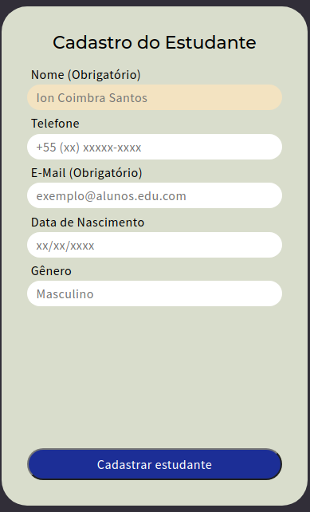
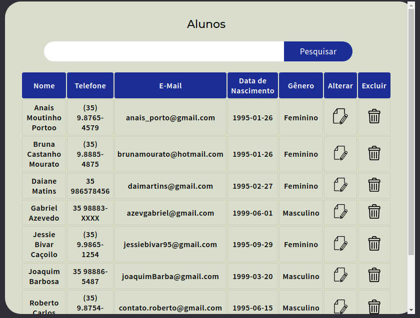

<p align="center" float="left">
  
  
  
</p>
<p align="center" float="left">
  
  
</p>

<h1 align="center">CRUD-PHP-MVC</h1>

<p align="center">
 <a href="#Objetivo">Objetivo</a> •
 <a href="#Acesso">Acesso</a> •
 <a href="#Pré-requisitos">Pré-requisitos</a> • 
 <a href="#Tecnologias">Tecnologias</a> • 
 <a href="#Autores">Autores</a>
</p>


### Objetivo

<p align="center">"Fazer CRUD baseado em um sistema de controle de alunos."</p>

### Acesso

Em breve.

### Pré-requisitos

Antes de começar, você vai precisar ter instalado em sua máquina as seguintes ferramentas:
[Git](https://git-scm.com). 
Além disto é bom ter um editor para trabalhar com o código como [VSCode](https://code.visualstudio.com/)

```bash
# Clone este repositório
$ $ git clone <https://github.com/azevgabriel/CRUD-PHP-MVC>

# Acesse a pasta do projeto no terminal/cmd
$ cd CRUD-PHP-MVC

# Abra sua IDE
$ code .

```

### Tecnologias

As seguintes ferramentas foram usadas na construção do projeto:

- [PHP](https://www.php.net/)

### Autores

Foto   | Descrição
--------- | ------
| <strong>Gabriel Azevedo</strong>, 1999 </br> Estudante de Engenharia de Computação </br>IFSULDEMINAS - Poços de Caldas</br></br> - <a href="https://github.com/azevgabriel">GitHub</a> </br> - <a href="https://www.linkedin.com/in/azevgabriel/">LinkedIn</a>
