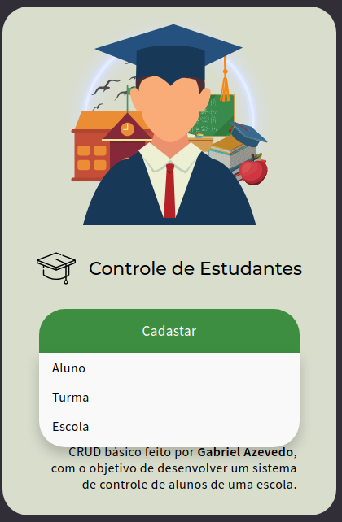

<p align="center" float="left">
  
  
  
</p>
<p align="center" float="left">
  
  
</p>

<h1 align="center">CRUD-PHP-MVC</h1>

<p align="center">
 <a href="#Objetivo">Objetivo</a> •
 <a href="#Acesso">Acesso</a> •
 <a href="#Pré-requisitos">Pré-requisitos</a> • 
 <a href="#Tecnologias">Tecnologias</a> • 
 <a href="#Autor">Autor</a>
</p>


### Objetivo

<p align="center">"Fazer CRUD baseado em um sistema de controle de alunos."</p>

  - O usuário pode:
    - Criar um Aluno, uma turma ou uma escola.
    - Listar todos(as) os Alunos, as turmas e as escolas.
    - Fazer uma busca nessas listagens.
    - Realizar uma atualização de um aluno, turma ou escola.
    - Deletar da lista o aluno, turma ou escola.

### Acesso

Em breve.

### Pré-requisitos

Antes de começar, você vai precisar ter instalado em sua máquina as seguintes ferramentas:
[Git](https://git-scm.com), [MySQL](https://www.mysql.com/), [Apache](https://httpd.apache.org/), [PHP](https://www.php.net/).
</br>
Além disto é bom ter um editor para trabalhar com o código como [VSCode](https://code.visualstudio.com/).

Ou se preferir utilize [XAMPP](https://www.apachefriends.org/pt_br/index.html), que contém o PHP, Apache e um Banco de Dados.

No seu terminal Git, faça os seguintes comandos.

```bash
# Clone este repositório
$ git clone <https://github.com/azevgabriel/CRUD-PHP-MVC>

# Acesse a pasta do projeto no terminal/cmd
$ cd CRUD-PHP-MVC

# Abra sua IDE
$ code .

```

### Tecnologias

As seguintes ferramentas foram usadas na construção do projeto:

- [PHP](https://www.php.net/)
- [MySQL](https://www.mysql.com/)

### Autor

Foto   | Descrição
:---: | :---:
| <strong>Gabriel Azevedo</strong>, 1999 </br> Estudante de Engenharia de Computação </br>IFSULDEMINAS - Poços de Caldas</br></br>[](https://github.com/azevgabriel)[](https://www.linkedin.com/in/azevgabriel/)[](https://vercel.com/azevgabriel/)

